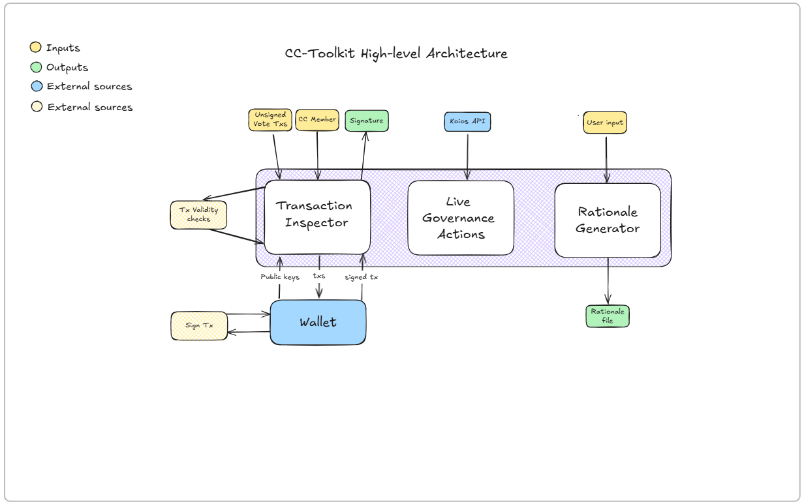

# Intersect Council Toolkit App

This App will allow Intersect council to be able to vote on governance actions, by connecting their wallet to this app.

## Table of Contents

1. [Usage](#usage)
2. [Architecture](#architecture)
3. [License](#license)

## Usage

### Transaction Inspector page

* Allows you to inspect your transaction and sign it.
1. Select which CC member you are part of.
2. Paste/upload your unsigned transaction on the input box.
3. Connect to your wallet, for wallet related validation of the transaction and if you want to sign it.
4. Validity check will be automatically preformed upon transaction.
5. If the unsigned transaction passes all validity checks you will be able to pass the transaction to your wallet for signing, producing a signature.
### Live Governance Actions Page 

* Displays all live governance actions you can vote on-chain.
1. Select which CC member you are part of to view your vote status on live governance actions.
### Rationale Generator

* To create a vote rationale metadata based on CIP-136 schema.
1. Required fields: Summary , Rationale Statement .
2. Optional fields: Precedent discussion, counter argument discussion, internal vote, references list.
3. Once ready click DOWNLOAD button to get the jsonld file.

## Architecture

